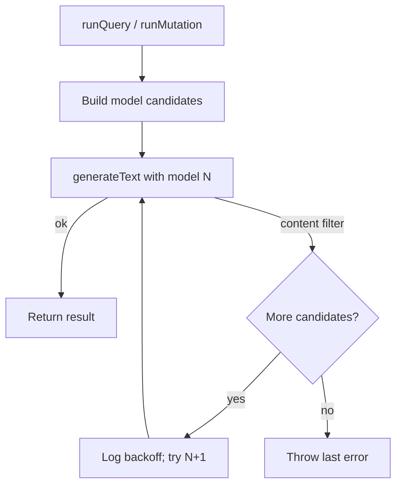

# MCP OpenRouter model backoff

## MCP tool coverage (checked)

All LLM-using MCP tools go through `runQuery` / `runMutation` in [`packages/server/src/mcp/server.ts`](packages/server/src/mcp/server.ts). Wrapping those two functions covers every tool that can hit Alibaba content filter — **no MCP tool-handler changes needed**.

| MCP tool | Uses LLM? | Calls | Covered by backoff? |
|---|---|---|---|
| `memory_query` | Yes | `runQuery` | Yes |
| `memory_add` | Yes | `runMutation` | Yes |
| `memory_update` | Yes | `runMutation` | Yes |
| `memory_maintain` | Yes (only if graph unhealthy) | `runMutation` | Yes |
| `memory_status` | No (deterministic validate/lint) | — | N/A (no model) |

## Scope

| Path | Behavior |
|---|---|
| MCP → `runQuery` / `runMutation` (tools above) | Auto-retry next model in `OPENROUTER_MODELS` on content-filter errors |
| Web `streamChat` | No auto-backoff (errors often mid-stream; UI already has model picker) |
| Explicit `options.model` (e.g. future callers) | Honor that model only — no chain retry |

## Fallback chain

Reuse [`openRouterModels()`](packages/core/src/providers/index.ts) (already: `LLM_MODEL` first, then `OPENROUTER_MODELS`).

```
primary = options.model ?? LLM_MODEL
if provider !== openrouter OR options.model set → [primary] only
else → [primary, ...openRouterModels() without primary]
```

Example with your Portainer list: `qwen/qwen3.7-plus` fails → try `google/gemini-2.5-flash` → `deepseek/deepseek-v4-flash` → …



## Mutation safety

If a mutate attempt already wrote files (`filesChanged.size > 0`) and then hits content filter, **do not retry** — avoid double-writes / conflicting patches. Log and rethrow. Queries are always safe to retry.

## Implementation

1. **Shared helpers** — new [`packages/core/src/providers/backoff.ts`](packages/core/src/providers/backoff.ts) (or next to pricing in providers):
   - `formatUnknownError(error)` (move/share logic currently in [`chat.ts`](packages/server/src/api/chat.ts))
   - `isContentFilterError(error)` — same regex as UI (`inappropriate content|content.?filter|…`)
   - `openRouterFallbackChain(options, env)` — candidate list as above
   - Export from providers index; refactor `chat.ts` to import `formatUnknownError` / `isContentFilterError` so detection stays one place

2. **Agent loop** — [`packages/core/src/agent/agent.ts`](packages/core/src/agent/agent.ts):
   - Extract inner `generateText` bodies
   - Wrap with `for (const modelId of chain) { try … catch if content-filter && more candidates continue; else throw }`
   - `console.warn('[understory] content filter on %s; retrying with %s', failed, next)`
   - Fresh `TraceRecorder` / `filesChanged` per attempt

3. **Tests** — [`packages/core/test/backoff.test.ts`](packages/core/test/backoff.test.ts):
   - Chain order with/without explicit model
   - `isContentFilterError` true for Alibaba-style message, false for generic 502
   - Mutation: no retry after files already written (unit-test the guard helper)

4. **Docs** — [`.env.example`](.env.example) / [`build.md`](build.md): note that `OPENROUTER_MODELS` order is the MCP backoff order after `LLM_MODEL`.

## Out of scope

- Streaming chat auto-retry
- Cross-provider fallback (anthropic → openrouter)
- Changing MCP tool APIs
