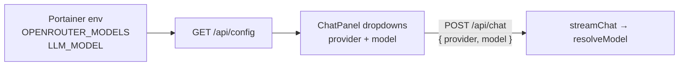

# OpenRouter model picker in Agent chat

## Recommendation

Keep the existing **provider** dropdown. Add a second **model** dropdown next to it (same header row as in your screenshot).

Wire model selection into the chat request body (API already accepts it):

```47:51:packages/server/src/api/chat.ts
const { provider, model } = req.body as ChatBody;
const { result } = await streamChat(kb, trimmed.messages, { provider, model });
```

Today the UI only sends `provider`:

```65:65:packages/web/src/components/ChatPanel.tsx
body: () => ({ provider }),
```

**Model list source (chosen default for Portainer):** env allowlist `OPENROUTER_MODELS`, default selection = `LLM_MODEL`.

Why this over fetching all OpenRouter models: your stack is ops-driven via compose; a short curated list avoids a huge noisy catalog and needs no extra OpenRouter HTTP call from the server. Changing models = edit Portainer env + restart (or redeploy), not a code rebuild.

Example compose addition (recommended allowlist for Understory agent + content-filter escape hatch):

```yaml
LLM_PROVIDER: openrouter
LLM_MODEL: qwen/qwen3.7-plus
OPENROUTER_MODELS: qwen/qwen3.7-plus,google/gemini-2.5-flash,deepseek/deepseek-v4-flash,deepseek/deepseek-v4-pro,anthropic/claude-sonnet-4
OPENROUTER_API_KEY: sk-xxxx
```

### Peer models vs `qwen/qwen3.7-plus` (for filling OPENROUTER_MODELS)

Baseline Qwen3.7 Plus: ~$0.32 / $1.28 per 1M in/out, **1M context**, strong agent/tool use, cheap long pastes — but Alibaba route can hit **content filter** on sensitive topics.

| OpenRouter id | Role vs Qwen3.7 Plus | Approx $/1M in/out | Context | Notes for Understory |
|---|---|---|---|---|
| `qwen/qwen3.7-plus` | Default / cheapest long-context | 0.32 / 1.28 | 1M | Keep as daily driver |
| `google/gemini-2.5-flash` | Closest **price + speed** peer | 0.30 / 2.50 | large | Good fallback; less Alibaba filter risk |
| `deepseek/deepseek-v4-flash` | Cheaper / faster agent peer | ~0.09–0.14 / ~0.18–0.28 | up to 1M | Strong coding/tools; great cost escape hatch |
| `deepseek/deepseek-v4-pro` | Stronger reasoning step-up | ~0.44 / ~0.87 | large | When Flash is too weak on hard graph edits |
| `anthropic/claude-sonnet-4` | **Quality** peer (not price) | 3.00 / 15.00 | 1M | Best tool reliability; use when Qwen blocked or messy |

Not recommended as first peers for this list: `qwen/qwen3.7-max` (same Alibaba family / filter risk, much pricier). Prefer non-Alibaba routes when the goal is escaping content blocks.

When Qwen hits Alibaba content filter, switch the UI model to Gemini/DeepSeek/Claude and Retry — no compose edit mid-session.




## Implementation

1. **Core config** — [`packages/core/src/providers/index.ts`](packages/core/src/providers/index.ts)
   - Parse `OPENROUTER_MODELS` (comma-separated).
   - Ensure `LLM_MODEL` is always included in the list if set.
   - Export something like `openRouterModels(): string[]` (empty when OpenRouter unused).

2. **Config API** — [`packages/server/src/api/browse.ts`](packages/server/src/api/browse.ts) + [`packages/web/src/api.ts`](packages/web/src/api.ts)
   - Extend `/api/config` with `modelsByProvider: { openrouter?: string[]; ... }` and keep `defaultModel`.
   - For non-OpenRouter providers, either omit or expose a single-entry list `[defaultModel]` so the model select still makes sense.

3. **Chat UI** — [`packages/web/src/components/ChatPanel.tsx`](packages/web/src/components/ChatPanel.tsx)
   - State: `model` (default `config.defaultModel`).
   - Header: provider select + model select (model options from `config.modelsByProvider[provider]`).
   - When provider changes, reset model to that provider’s first/default option.
   - Transport body: `{ provider, model }`.
   - Disable both selects while busy/resetting.

4. **Docs** — [`.env.example`](.env.example) and optionally a short note in [`build.md`](build.md) Portainer env section.

## Out of scope

- Fetching the full OpenRouter model catalog
- Per-message model badges in history
- Changing MCP/CLI model selection (still env-only)
